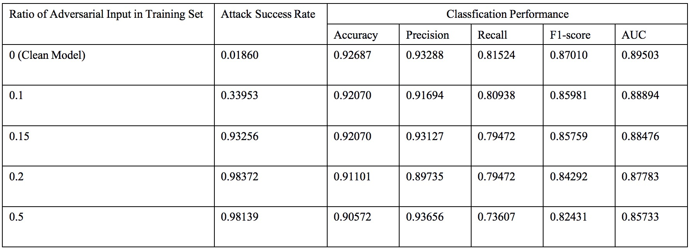

# Extending Neural Cleanse to Discrete Domain

[Neural Cleanse](http://people.cs.uchicago.edu/~ravenben/publications/pdf/backdoor-sp19.pdf) (IEEE S&P 2019) describes a detection tool against backdoor (Trojan) attacks on deep neural networks in vision domain. Can it be extended to the discrete domain such as binary-valued vectors, text, and code?

After experiments and exploration, my answer is: Yes.

## Overview

I followed BadNets to inject a backdoor to an LSTM-based binary feature classifier. Then I re-implemented the framework in Neural Cleanse to detect and reverse engineer triggers in this task of discrete domain by designing a slightly different trigger pattern, optimization function, and optimization method.

#### 1. Classification task

#### 2. Backdoor attack

#### 3. Reverse Engineering Triggers

i. A generic form of trigger injection

  
ii. Optimization function

iii. Optimization method

## Experiments

1. Table: Attack success rate and classification performance of backdoor injection attack under different ratio of adversarial input in training set.

  
2. Observation from reverse engineering triggers in discrete domain

- Reverse engineering triggers in discrete domain is equivalent to the feature selection problem. The features selected by the trigger pattern always have **the greatest gradient**. This indicates that:
  - It is difficult for an attacker to inject backdoors to models in discrete domain, as the trigger can be easily reverse engineered guided by the gradient. So backdoor attacks in discrete domain with more stealth should be explored in the future.

- By varying different feature set cardinality, I visulized the training loss during the reverse engineering process.
  Note: The actual infected target label is label 1. And the actual trigger pattern is the feature set: {(0, 4000), (0, 4001), (1, 4000), (1, 4001)}.

  i. Assuming label 1 is the target label.
  
  

  - When feature set cardinality = 2: the reverse engineered trigger is {(1, 4000), (1, 4001)}.
  - When feature set cardinality = 3: the reverse engineered trigger is {(1, 4000), (1, 4001), (0, 4001)}.
  - When feature set cardinality = 4: the reverse engineered trigger is {(1, 4000), (1, 4001), (0, 4001), (0, 4000)}.
  - When feature set cardinality = 6: the reverse engineered trigger is {(1, 4000), (1, 4001), (0, 4001), (0, 4000), (1, 28), (1, 75)}.
  
  ii. Assuming label 0 is the target label.
  
  

## Acknowledgement

The above work is done by [Yutong Wang](https://rainytong.github.io/). The codes will be released after our paper submission. 
  
