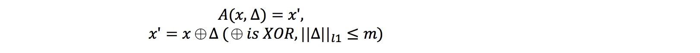

# Extending Neural Cleanse to Discrete Domain

[Neural Cleanse](http://people.cs.uchicago.edu/~ravenben/publications/pdf/backdoor-sp19.pdf) (IEEE S&P 2019) describes a detection tool against backdoor (Trojan) attacks on deep neural networks in vision domain. Can it be extended to the discrete domain such as binary-valued vectors, text, and code?

After experiments and exploration, my answer is: Yes.

## Overview

I followed BadNets to inject a backdoor to an LSTM-based binary feature classifier. Then I re-implemented the framework in Neural Cleanse to detect and reverse engineer triggers in this task of discrete domain by designing a slightly different trigger pattern, optimization function, and optimization method.

### 1. Classification task

### 2. Backdoor attack

### 3. Attack success rate and classification performance of backdoor injection attack under different ratio of adversarial input in training set

### 4. Reverse Engineering Triggers

i) Define a generic form of trigger injection:

